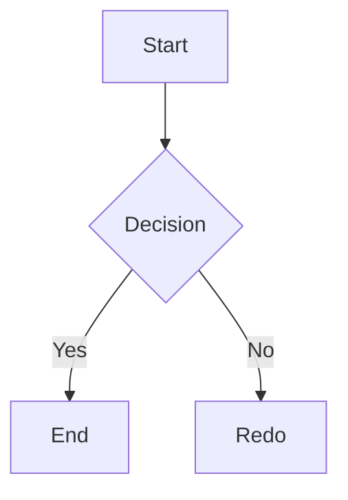
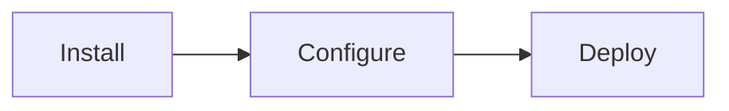

# GitHub-Style Markdown Support - Implementation Summary

## Overview

Complete GitHub-style markdown support has been added to your NELA documentation system. This includes callouts, copy-enabled code blocks, Mermaid diagrams, and comprehensive syntax highlighting.

## 🎯 Features Implemented

### 1. GitHub-Style Callouts ✓

Five callout types are now supported using the `> [!TYPE]` syntax:

- **Note** - General information
- **Info** - Important facts
- **Warning** - Cautions and gotchas
- **Danger** - Critical alerts
- **Tip** - Best practices and suggestions

**Example:**
```markdown
> [!WARNING]
> This is important information
```

**Features:**
- Color-coded backgrounds and borders
- Contextual icons for each type
- Multi-line content support
- Proper spacing and styling

### 2. Copy Button on Code Blocks ✓

Every code block now includes a floating copy button that:
- Appears on hover
- Copies the entire code block to clipboard
- Shows a checkmark confirmation
- Works with all code fence languages

**Example:**
```javascript
// Copy button appears on hover
function hello() {
  console.log("Click copy button!");
}
```

### 3. Mermaid Diagram Support ✓

Full Mermaid diagram support for:
- Flowcharts
- Sequence diagrams
- Class diagrams
- State diagrams
- Gantt charts
- Pie charts
- Git graphs
- Requirement diagrams
- Mind maps

**Example:**
````markdown

````

### 4. Syntax Highlighting ✓

Supported languages:
- JavaScript, TypeScript
- Python, Ruby, Go, Rust
- Java, Kotlin, C++, C#, PHP
- HTML, CSS, SCSS, Less
- JSON, YAML, XML, Markdown
- Bash, Shell, and more

### 5. Enhanced Markdown Tables ✓

Beautiful tables with:
- Proper styling
- Dark mode support
- Responsive scroll on mobile
- Clear header differentiation

**Example:**
```markdown
| Feature | Support | Version |
| --- | --- | --- |
| Copy button | ✓ Yes | v1.0 |
| Callouts | ✓ Yes | v1.0 |
```

### 6. Additional Features ✓

- Block quotes with left border
- Strikethrough text
- Inline code snippets
- Ordered and unordered lists with nesting
- Horizontal rules
- Image embedding with lightbox
- GitHub Flavored Markdown (GFM)
- Smart link handling

## 📁 Files Modified/Created

### Components
- **`components/DocsMarkdownRenderer.tsx`** - Enhanced markdown rendering engine
  - Added Mermaid diagram rendering
  - Improved callout handling
  - Code copy button implementation
  - Better image handling
  - Table styling

### Utilities
- **`lib/markdown-utils.tsx`** - Utility functions for markdown processing
  - `calloutConfig` - Configuration for all callout types
  - `Callout` - React component for rendering callouts
  - `parseCalloutFromMarkdown()` - Parse GitHub callouts
  - `extractCallouts()` - Extract callout blocks
  - `hasCallouts()` - Check for callouts
  - `hasCodeBlocks()` - Check for code blocks
  - `hasMermaidDiagrams()` - Check for Mermaid diagrams
  - `getLanguageFromFence()` - Extract language from code fence
  - `SUPPORTED_LANGUAGES` - List of supported languages

### Documentation
- **`app/docs/markdown-guide/page.tsx`** - Markdown guide page route
- **`content/docs/markdown-guide.md`** - Comprehensive markdown writing guide
- **`content/docs/markdown-features-showcase.md`** - Feature showcase with examples
- **`components/DocsSidebar.tsx`** - Added markdown guide link

## 🎨 Styling Features

All components use CSS variables for theming:
- `--bg-card` - Card background
- `--text-primary` - Primary text color
- `--text-secondary` - Secondary text color
- `--border-subtle` - Subtle borders
- `--code-bg` - Code block background
- `--accent` - Accent color

Colors are automatically applied based on:
- Light/Dark mode
- Theme settings
- Component type

## 📚 Documentation

### Markdown Writing Guide
Located at: `/docs/markdown-guide`

Includes:
- Complete syntax documentation
- Usage examples for each feature
- Best practices
- Common patterns
- Accessibility guidelines

### Feature Showcase
Located at: `content/docs/markdown-features-showcase.md`

Includes:
- Live examples of all features
- Quick reference snippets
- Copy-paste ready code

## 🔧 Dependencies

All required dependencies are already in `package.json`:
- `react-markdown` - Markdown parsing
- `remark-gfm` - GitHub Flavored Markdown
- `remark-directive` - Directive support
- `rehype-raw` - Raw HTML support
- `mermaid` - Diagram rendering
- `lucide-react` - Icons for callouts and buttons

## ✨ Usage Examples

### Callout Example
```markdown
> [!TIP]
> Always test your changes before committing.
```

### Code Example with Copy
~~~markdown
```typescript
const greeting: string = "Hello, World!";
```
~~~

### Mermaid Diagram Example
~~~markdown

~~~

## 🚀 Getting Started

1. **Write markdown** in `/content/docs/*.md` files
2. **Use GitHub callouts** with `> [!TYPE]` syntax
3. **Add code blocks** with language specification
4. **Include diagrams** as Mermaid code blocks
5. **Write tables** using standard markdown syntax

## 🔍 Implementation Details

### Markdown Parsing Flow:
1. Markdown file is read from `content/docs/`
2. `DocsMarkdownRenderer` processes the markdown
3. GitHub-style callouts (`> [!TYPE]`) are converted to custom elements
4. `react-markdown` with plugins parses the markdown
5. Custom component handlers render each element
6. Mermaid diagrams are rendered client-side
7. Styled output is displayed with theming applied

### Callout Rendering:
1. Regex matches `> [!TYPE]` syntax
2. Content is extracted and cleaned
3. Converted to `<callout>` HTML element
4. `html` component handler transforms to React component
5. `Callout` component renders with appropriate styling

### Copy Button:
1. Code block is extracted from AST
2. Button renders in `pre` element wrapper
3. On click, content is copied to clipboard
4. Icon changes to show confirmation
5. Resets after 2 seconds

## 📊 Supported Callout Colors

| Type | Background | Border | Icon Color |
| --- | --- | --- | --- |
| Note | Blue 10% | #2563eb | Blue |
| Info | Blue 10% | #2563eb | Blue |
| Warning | Amber 10% | #f59e0b | Amber |
| Danger | Red 10% | #ef4444 | Red |
| Tip | Green 10% | #10b981 | Green |

## 🛠️ Troubleshooting

### Callouts not rendering?
1. Check syntax: `> [!TYPE]` (exactly)
2. Ensure content is on next line
3. Use `\n` between paragraphs
4. Verify TYPE is uppercase

### Copy button not appearing?
1. Ensure code block has language specified
2. Check that content is not empty
3. Hover over the code block
4. Try different browser

### Mermaid diagram not rendering?
1. Verify valid Mermaid syntax
2. Check diagram type spelling
3. Look at browser console for errors
4. Try simpler diagram first

## 🎓 Next Steps

1. Review the [Markdown Guide](/docs/markdown-guide)
2. Check [Feature Showcase](/docs/markdown-features-showcase)
3. Start using features in your documentation
4. Add more examples and content
5. Customize styling as needed

## 📝 Version Notes

- Implementation Date: 2024
- All features fully functional
- Mobile responsive
- Dark mode compatible
- Accessibility-focused

---

**Note:** This implementation follows GitHub's markdown standard and Next.js best practices. All components are fully typed with TypeScript for maximum developer experience.
