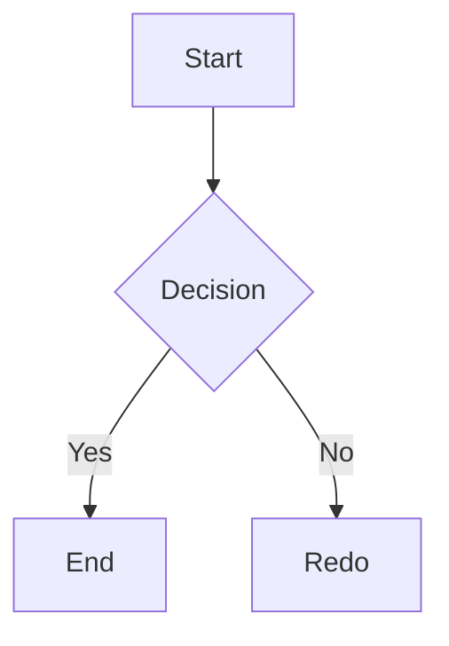
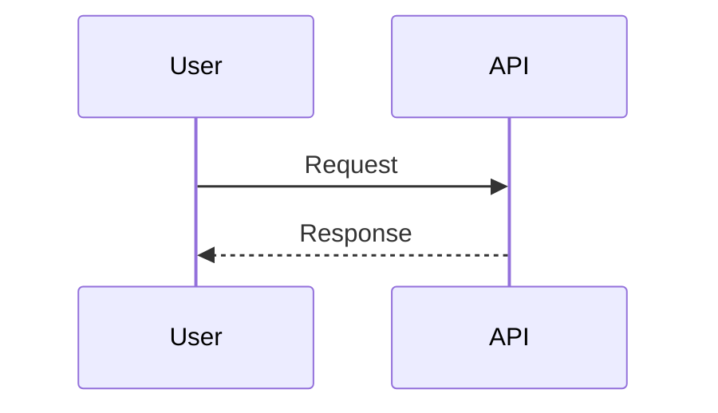
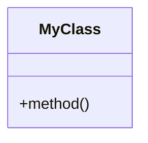
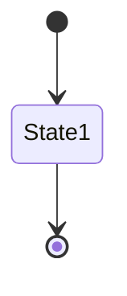
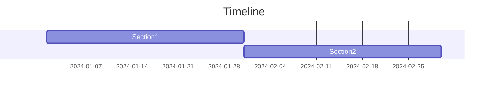
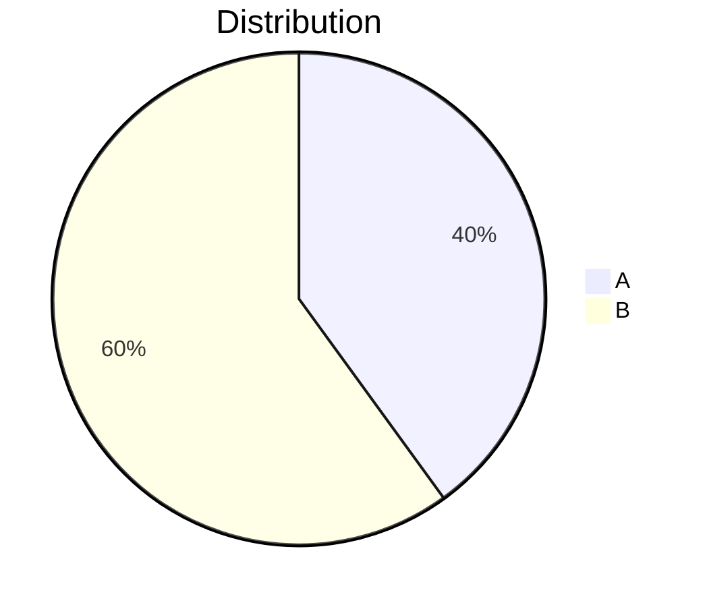
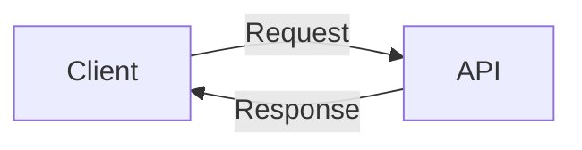

# Markdown Features - Quick Reference

## Callouts (GitHub Style)

```markdown
> [!NOTE]
> Note content here

> [!INFO]
> Info content here

> [!WARNING]
> Warning content here

> [!DANGER]
> Danger content here

> [!TIP]
> Tip content here
```

## Code Blocks (Hover for copy button)

```javascript
// Specify language for syntax highlighting
function example() {
  return "Copy button appears on hover!";
}
```

Supported: javascript, typescript, python, java, cpp, csharp, php, ruby, go, rust, kotlin, swift, html, css, scss, less, sql, json, yaml, xml, markdown, bash, and more.

## Mermaid Diagrams

### Flowchart


### Sequence


### Class


### State


### Gantt


### Pie


## Tables

```markdown
| Header 1 | Header 2 |
| --- | --- |
| Cell 1 | Cell 2 |
| Cell 3 | Cell 4 |
```

## Text Formatting

| Format | Syntax | Result |
| --- | --- | --- |
| Bold | `**text**` | **text** |
| Italic | `*text*` | *text* |
| Bold Italic | `***text***` | ***text*** |
| Strikethrough | `~~text~~` | ~~text~~ |
| Inline Code | `` `code` `` | `code` |

## Lists

```markdown
# Unordered
- Item 1
  - Nested item
  - Another nested
- Item 2

# Ordered
1. First
2. Second
   1. Sub-item
   2. Another sub
3. Third
```

## Blockquotes

```markdown
> This is a blockquote
> It can span multiple lines
>
> And have multiple paragraphs
```

## Links & Images

```markdown
[Link text](https://example.com)
[Link with title](https://example.com "hover text")

```

## Horizontal Rule

```markdown
---
```

## Complete Example

```markdown
# My Documentation Page

## Overview
This page demonstrates all features.

> [!INFO]
> Important information goes in callouts.

### Code Example

```python
def hello():
    print("Hello, World!")
```

### Architecture Diagram



### Features Table

| Feature | Status |
| --- | --- |
| Callouts | ✓ |
| Copy Button | ✓ |
| Diagrams | ✓ |

---

For more details, see the [Markdown Guide](/docs/markdown-guide).
```

---

**Need Help?** Check the [Markdown Guide](/docs/markdown-guide) page in the documentation for comprehensive examples and best practices.
