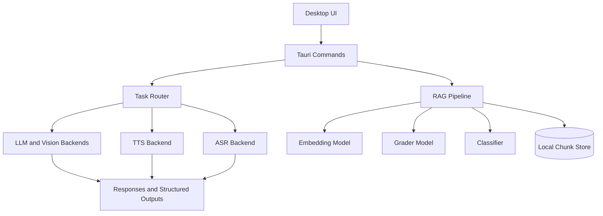

# Architecture

NELA uses a local desktop architecture where UI actions are routed to task-specific model backends. The frontend is React-based, and the desktop backend (Tauri + Rust) controls routing, model lifecycle, RAG ingestion, and output generation.

Core design principles:

- Local-first execution for chat, vision, audio, podcast, and mindmap workflows.
- Task routing so each request uses the most suitable installed model.
- Lazy model startup to reduce idle resource usage.
- Workspace-scoped persistence for chats, files, and generated artifacts.

System flow (conceptual):

In practical terms:

- Chat and Mindmap requests run through LLM tasks, optionally grounded with retrieved document chunks.
- Vision requests use a vision-language model plus projector pairing.
- Audio mode combines speech transcription and text-to-speech generation.
- Podcast mode generates a script first, then renders multi-speaker audio segments.
