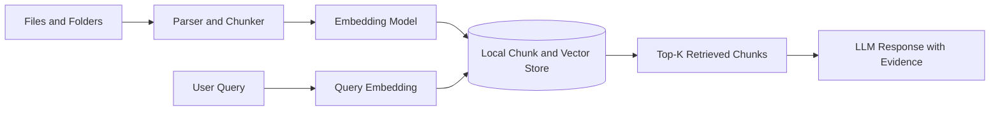

# Local Indexing

Local Indexing is NELA's retrieval layer. It lets the app ground responses in your own files without sending your source content to an external inference service.

## How it works

- You add files or folders from the workspace UI.
- NELA parses files into chunks and stores them in a local workspace index.
- Embedding models convert chunks and queries into vectors for similarity search.
- Classifier and grader models can improve retrieval quality and ranking.
- Retrieved chunks are passed into generation prompts for grounded responses.

Supported ingestion spans common docs, text, code, and selected audio formats used in transcription-assisted flows.

## Architecture snapshot

