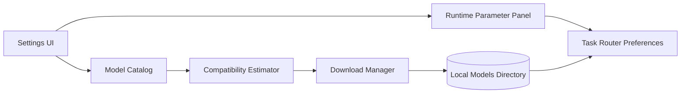

# Model Management

Model Management in NELA is handled from Settings and mode selectors. It covers model download, removal, runtime tuning, and compatibility checks.

## How it works

- Models are grouped by task class: LLM, Vision, TTS, ASR, Embedding, Classifier, and Grader.
- Downloads and uninstall operations are managed from the in-app settings workflow.
- Compatibility estimation checks RAM, CPU, and disk before large downloads.
- Runtime parameters (context size, max tokens, temperature, top-p/top-k, repeat penalty, and backend controls) are configurable per model.
- Mode selectors let you switch active installed models without changing conversation flow.

## Architecture snapshot

