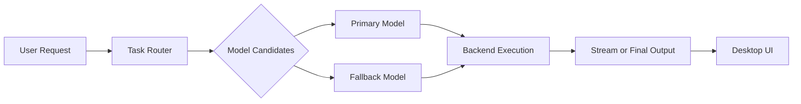

# Private Inference

Private Inference means core generation runs on your machine using locally installed model backends. For normal workflows, your prompts and indexed document content do not need a hosted inference API.

## How it works

- You pick a mode and submit a request from the desktop UI.
- The task router selects candidate models by task type and priority.
- Required models are started lazily, then reused while active.
- If one candidate fails, routing can fall back to the next compatible model.
- Streaming and final outputs are emitted back to the UI for responsive interaction.

This same mechanism powers Chat, Mindmap generation, and parts of Podcast workflows.

## Architecture snapshot

