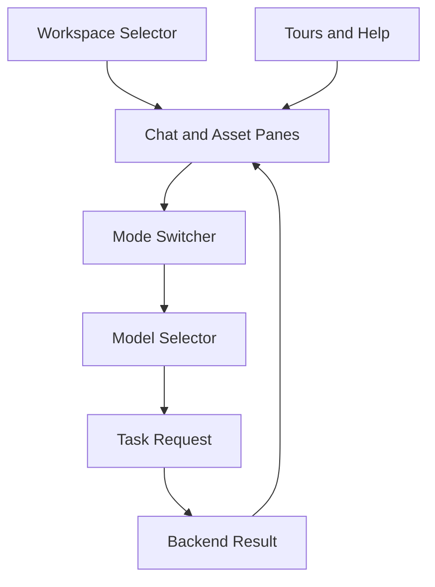

# UI Integration

NELA's UI is designed around project workspaces and mode-based interaction so users can move from chat to audio, podcast, or mindmap generation without leaving the same app context.

## How it works

- Workspaces group chats, uploaded documents, generated audio, and mindmaps per project.
- The mode switcher changes behavior in-place (Chat, Vision, Audio, Podcast, Mindmap).
- Model selectors adapt to the active mode so users can switch quality/speed quickly.
- Sidebars expose saved chats, audio assets, and mindmaps for rapid revisit.
- Built-in tours and help content reduce onboarding friction for new users.

## Architecture snapshot

