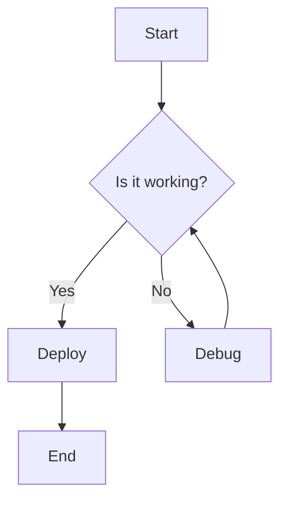
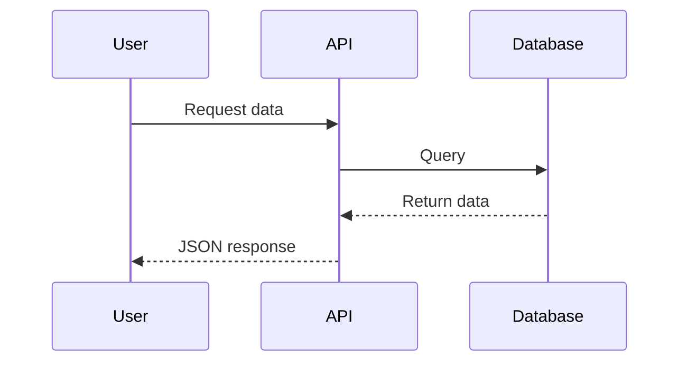
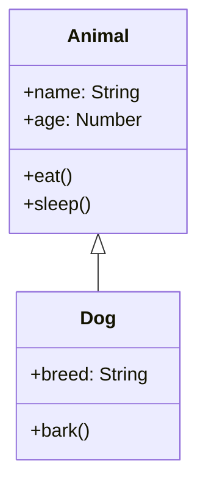
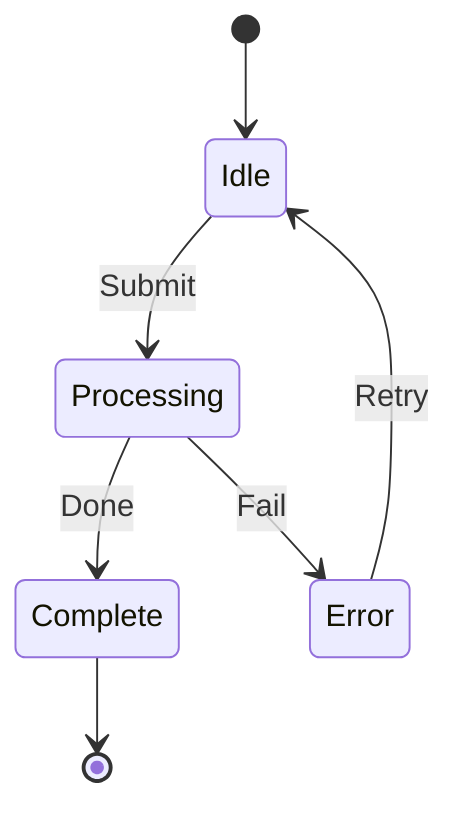
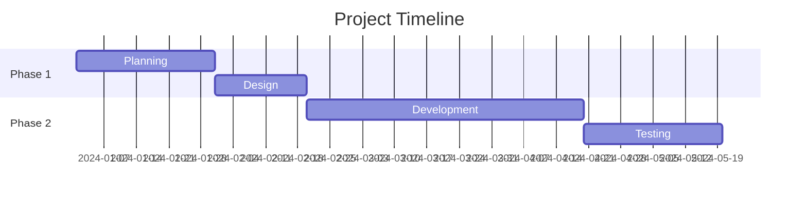
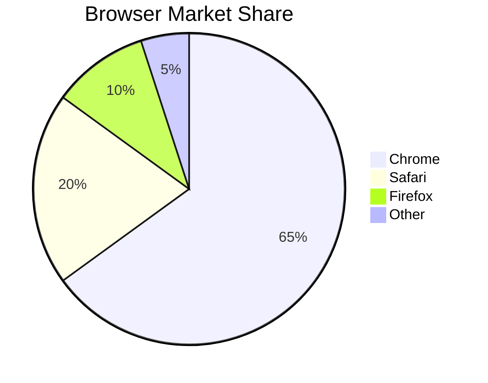
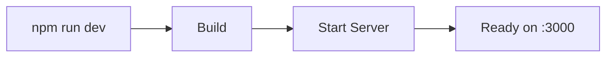

# Documentation Markdown Guide

Welcome to the complete guide for writing documentation with our enhanced markdown support. This page explains all the features available and how to use them effectively.

## Table of Contents

1. [GitHub-Style Callouts](#github-style-callouts)
2. [Code Blocks & Syntax Highlighting](#code-blocks--syntax-highlighting)
3. [Mermaid Diagrams](#mermaid-diagrams)
4. [Tables](#tables)
5. [Text Formatting](#text-formatting)
6. [Best Practices](#best-practices)

## GitHub-Style Callouts

Callouts are used to draw attention to important information. We support five types: **Note**, **Info**, **Warning**, **Danger**, and **Tip**.

### Syntax

Use the following syntax to create a callout:

```markdown
> [!TYPE]
> Your content here
```

Replace `TYPE` with one of: `NOTE`, `INFO`, `WARNING`, `DANGER`, or `TIP`.

### Examples

#### Note
> [!NOTE]
> This is a note. Use it for general information that doesn't fit other categories.

#### Info
> [!INFO]
> This is informational content. Use it to highlight important facts.

#### Warning
> [!WARNING]
> This is a warning. Use it to alert users about potential issues or gotchas.

#### Danger
> [!DANGER]
> This is a danger alert. Use it for critical information requiring immediate attention.

#### Tip
> [!TIP]
> This is a helpful tip. Use it to share best practices and suggestions.

### Multi-line Content

Callouts can span multiple lines:

> [!WARNING]
> This is important!
> 
> Make sure to:
> - Read all instructions
> - Test your changes
> - Follow the guidelines

## Code Blocks & Syntax Highlighting

Code blocks with copy buttons are a core feature of the documentation.

### Basic Syntax

\`\`\`language
your code here
\`\`\`

### Supported Languages

We support syntax highlighting for:

- **JavaScript/TypeScript**: javascript, typescript, js, ts
- **Python**: python, py
- **Java/Kotlin**: java, kotlin
- **C/C++/C#**: cpp, csharp, c
- **Web**: html, css, scss, less, xml
- **Markup**: json, yaml, xml, markdown
- **Shell**: bash, shell, sh
- **And many more!**

### Examples

```javascript
// JavaScript example with copy button
function calculateSum(a, b) {
  return a + b;
}

console.log(calculateSum(5, 3)); // Output: 8
```

```python
# Python example
def fibonacci(n):
    if n <= 1:
        return n
    return fibonacci(n-1) + fibonacci(n-2)

print(fibonacci(10))
```

```bash
# Bash/Shell commands
npm install
npm run dev
# Your development server is running
```

### Copy Button

Hover over any code block to see the copy button appear. Click it to copy the entire code block to your clipboard.

## Mermaid Diagrams

Mermaid diagrams help visualize concepts, workflows, and architectures. We support multiple diagram types.

### Flowchart

Perfect for showing processes and decision flows:



### Sequence Diagram

Great for showing interactions between components:



### Class Diagram

Use for showing object-oriented relationships:



### State Diagram

Show state machines and workflows:



### Gantt Chart

Perfect for project timelines:



### Pie Chart

Show data distribution:



## Tables

Tables help present structured information clearly.

### Syntax

```markdown
| Column 1 | Column 2 | Column 3 |
| --- | --- | --- |
| Data 1 | Data 2 | Data 3 |
| Data 4 | Data 5 | Data 6 |
```

### Example

| Feature | Status | Version |
| --- | --- | --- |
| Copy button | ✓ Supported | v1.0 |
| Callouts | ✓ Supported | v1.0 |
| Mermaid | ✓ Supported | v1.0 |
| Tables | ✓ Supported | v1.0 |
| Dark mode | ✓ Supported | v1.0 |

## Text Formatting

### Bold

Use `**text**` or `__text__`:

**This is bold text**

### Italic

Use `*text*` or `_text_`:

*This is italic text*

### Bold and Italic

Use `***text***`:

***This is bold and italic***

### Strikethrough

Use `~~text~~`:

~~This is strikethrough~~

### Inline Code

Use backticks to highlight code within text:

Use the `npm install` command to install dependencies.

### Links

```markdown
[Link text](https://example.com)

[Link with title](https://example.com "Hover text")
```

### Lists

#### Unordered List

```markdown
- Item 1
- Item 2
  - Nested item
  - Another nested item
- Item 3
```

#### Ordered List

```markdown
1. First step
2. Second step
   1. Sub-step
   2. Another sub-step
3. Third step
```

### Blockquotes

```markdown
> This is a blockquote
> It can span multiple lines
> 
> And include **formatting**
```

Result:

> This is a blockquote
> It can span multiple lines
>
> And include **formatting**

## Best Practices

### 1. Use Callouts Strategically

- **Notes**: For general information
- **Info**: For important facts
- **Warnings**: For potential issues
- **Danger**: For critical alerts
- **Tips**: For helpful suggestions

> [!TIP]
> Don't overuse callouts. Use them only for information that needs special attention.

### 2. Keep Code Examples Short

Good code examples are:
- ✓ Focused and specific
- ✓ Runnable (include needed imports)
- ✓ Properly commented

### 3. Use Diagrams to Explain Complex Concepts

Diagrams are especially useful for:
- System architecture
- Workflow processes
- Data relationships
- Decision flows

### 4. Consistent Formatting

- Use consistent heading levels
- Keep spacing between sections
- Align content logically
- Use consistent language

> [!WARNING]
> Avoid mixing markdown and HTML unless necessary. Stick to standard markdown syntax for consistency.

### 5. Accessibility

- Add alt text to images
- Use semantic heading hierarchy
- Provide code examples in multiple languages
- Avoid color-only differentiation

### 6. Code Block Best Practices

```typescript
// Always:
// ✓ Specify the language for syntax highlighting
// ✓ Include necessary imports
// ✓ Provide complete, runnable examples
// ✓ Add comments for clarity

interface User {
  id: number;
  name: string;
}

const user: User = { id: 1, name: "John" };
```

## Examples of Combined Features

### Setup Guide with Multiple Features

> [!INFO]
> This guide assumes you have Node.js 18+ installed.

#### Step 1: Install Dependencies

```bash
npm install
npm run setup
```

#### Step 2: Configure

Create a `config.json` file:

```json
{
  "port": 3000,
  "debug": true,
  "maxRetries": 3
}
```

> [!WARNING]
> Don't commit your config file with sensitive data. Use environment variables instead.

#### Step 3: Start Development

```bash
npm run dev
```

You should see this flow:



---

For more information, explore other documentation sections!
