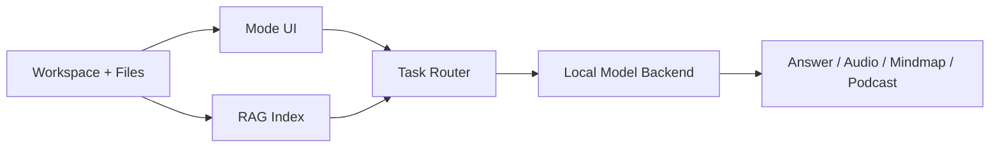

# What is it?

NELA is a local-first desktop AI workspace for private, multimodal work on your own machine. It combines chat, document grounding, vision prompts, speech workflows, podcast generation, and mindmaps in one application.

Instead of depending on a cloud inference backend for normal usage, NELA runs local model pipelines through its desktop runtime. Your workspace keeps chats, ingested documents, generated audio, and mindmaps together by project.

Typical first run flow:

1. Create a new workspace or import a `.nela` project.
2. Install the models needed for your tasks in Settings.
3. Choose a mode: Chat, Vision, Audio, Podcast, or Mindmap.
4. Start querying, generating, and iterating.

> [!TIP]
> Internet is mainly needed for downloading models (and optional model browsing). Core inference and RAG workflows are designed to run locally.

## Architecture preview

